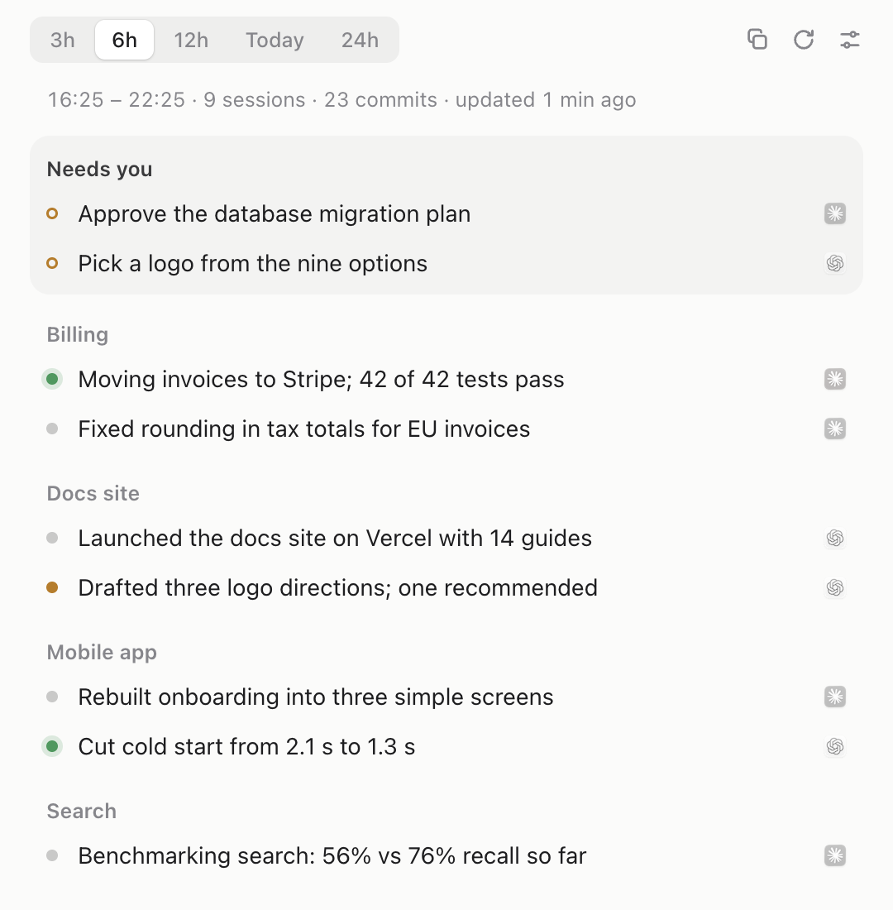
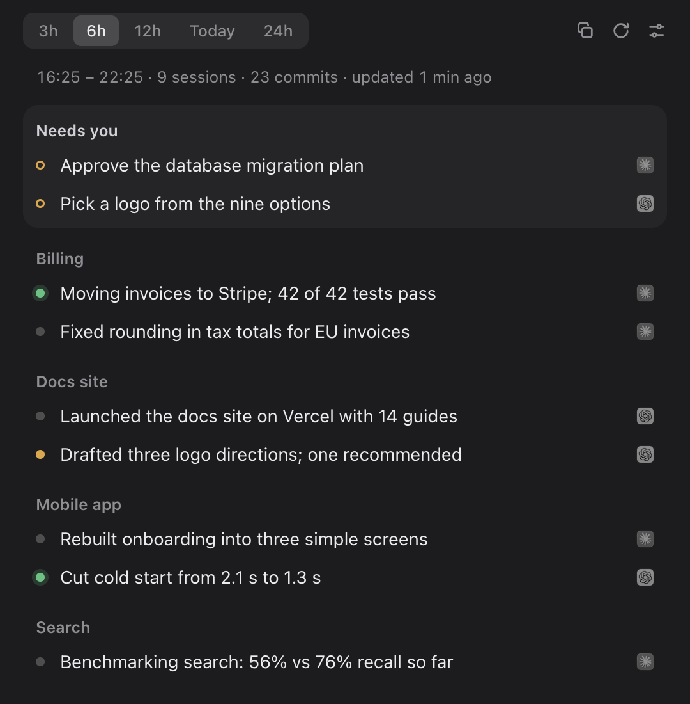

# Recap

**What did I just get done?** Recap reads your Claude Code and Codex sessions and your git commits, and turns the last few hours into one-liners in your menu bar. It also tells you which chats are waiting on you, and takes you straight to them.

<p align="center">
  
  
</p>

- **One line per piece of work**, grouped by project. A green dot is still running, amber is waiting on you, grey is done.
- **Needs you**: the decisions and answers your agents are waiting for, at the top.
- **Jump to the chat**: every line shows the app it happened in (Claude or Codex); click the icon to open that exact chat.
- **Notifications** (off by default): a note when a chat starts waiting on you. Click it to open the chat.
- **Your choice of model**: your OpenRouter account, a model on your own machine (Ollama, LM Studio, llama.cpp, vLLM), the Codex CLI, or the Claude Code CLI.
- **Also a CLI and an agent skill**, so `recap` works in a terminal and "what did I do today?" works inside Claude Code or Codex.

## Install

You need macOS for the menu bar app (the CLI also runs on Linux), Node.js 20 or newer, and one of the summarizers below.

```bash
git clone https://github.com/erphq/recap.git
cd recap
npm install            # or: bun install
npm run make-app       # builds Recap.app in this folder
open Recap.app
```

Recap.app runs the code in this folder, so keep the folder where it is; `git pull` updates the app without a rebuild. Drag Recap.app to your Dock or Applications if you like, and turn on **Open at Login** from the menu bar icon's right-click menu.

Try it without your own data first: `npm run demo`.

### The CLI

```bash
npm link               # puts `recap` on your PATH
recap                  # last 6 hours
recap 3h               # 3h, 6h, 12h, 24h, 2d or today
recap today --format md
recap needs            # chats waiting on you right now, no model involved
recap --digest         # the raw log the summary is written from
```

### The agent skill

Link the skill folder so your agents can answer "what have I done today?" with the same recap:

```bash
ln -s "$PWD/skill" ~/.claude/skills/recap     # Claude Code
ln -s "$PWD/skill" ~/.agents/skills/recap     # Codex
```

## Choosing who writes the recap

Open the panel, then the sliders icon (or ⌘,), and pick **Write recaps with**:

| Choice | What it uses | Setup |
|---|---|---|
| Automatic (default) | The first of these that is set up: OpenRouter, your local model, Codex, Claude Code | Nothing |
| OpenRouter | Your OpenRouter account and the model you pick (default `openai/gpt-6-luna`, about a third of a cent per recap) | **Connect** signs you in through your browser, or paste a key |
| Local model | Any server that speaks the OpenAI chat API | Server address and model name, below |
| Codex | `codex exec` on this Mac | Codex CLI installed and signed in |
| Claude Code | `claude -p` on this Mac | Claude Code CLI installed and signed in |

A specific choice never falls back to another one, so with **Local model** selected your log never leaves your machine. Automatic tries the next option when one fails and says so under the recap.

### Local models

Point Recap at your server's OpenAI-compatible address and pick a model; **Check** lists what the server has.

| Server | Address |
|---|---|
| [Ollama](https://ollama.com) | `http://localhost:11434/v1` |
| [LM Studio](https://lmstudio.ai) | `http://localhost:1234/v1` |
| [llama.cpp](https://github.com/ggml-org/llama.cpp) `llama-server` | `http://localhost:8080/v1` |
| [vLLM](https://github.com/vllm-project/vllm) | `http://localhost:8000/v1` |

Recap asks for strict JSON Schema output and falls back to JSON mode, then plain text, for servers that don't support it. It strips `<think>` blocks from reasoning models. Models from about 7B up do this well.

Local models usually have small context windows, so Recap trims the log for them to 32,000 characters (about 8,000 tokens). Give the model at least 16k tokens of context, for example `OLLAMA_CONTEXT_LENGTH=16384 ollama serve`, or `llama-server -c 16384`. To change the trim, set `local.maxChars` in `settings.json`.

## Notifications

Turn on **Notify me when a chat needs me** in Settings or in the menu bar icon's right-click menu. Recap checks every 20 seconds, reading only what changed:

- **Claude**: Code sessions the Claude desktop app marks as waiting on you, with what they're asking.
- **Codex**: questions a Codex chat has asked you and you haven't answered yet.

Anything already waiting when you switch notifications on isn't announced. Each ask is announced once, and asks older than six hours are skipped.

## What Recap reads

| Source | Where | What |
|---|---|---|
| Claude Code | `~/.claude/projects/*/*.jsonl` | Your prompts, the agent's final replies, files it edited |
| Claude desktop app | `~/Library/Application Support/Claude/claude-code-sessions` | Chat titles, chat links, "waiting on you" status |
| Codex | `~/.codex/sessions`, `~/.codex/session_index.jsonl` | Prompts, final replies, file changes, open questions |
| git | The repos those sessions worked in | Commits in the window, count of uncommitted files |

Chat links use the apps' own URL schemes: `claude://code/continue?session=…` and `codex://threads/…`.

## Privacy

- Recap only reads files on your machine. It has no server and sends no analytics. The settings screen fetches OpenRouter's public model list.
- The log goes to the summarizer you choose, and nowhere else. Common secret formats are redacted from it first (OpenAI, OpenRouter, GitHub, Slack and AWS keys, JWTs, private keys), but your prompts go as they are. Use a local model if they must stay on your machine.
- API keys are kept in the macOS Keychain (`Recap OpenRouter`, `Recap Local Model`), never in files.
- Recaps are cached in `.cache/` in this folder so the panel opens instantly. Delete the folder whenever you like.

## Configuration

Settings live in `settings.json` in this folder; the app writes it for you.

```json
{
  "engine": "auto",
  "model": "openai/gpt-6-luna",
  "local": { "baseUrl": "http://localhost:11434/v1", "model": "qwen3:8b", "maxChars": 32000 },
  "codexModel": "gpt-5.6-luna",
  "notify": false
}
```

| Environment variable | Use |
|---|---|
| `OPENROUTER_API_KEY` | OpenRouter key, instead of the Keychain |
| `RECAP_LOCAL_API_KEY` | Key for a local server that asks for one |
| `RECAP_SETTINGS` | Use a different settings file |
| `RECAP_EFFORT` | Codex reasoning effort (default `low`) |

## How it works

```
~/.claude, ~/.codex, git ──▶ lib/collect.mjs ──▶ one log, numbered by session
                                                   │
                     lib/summarize.mjs ◀───────────┘
                     (OpenRouter · local · Codex · Claude Code, JSON Schema)
                                                   │
                     bin/recap.mjs ──▶ .cache/recap-<range>.json ──▶ menu bar panel
lib/needs.mjs ──▶ app/notifier.mjs ──▶ notifications (no model involved)
```

Each line in the recap carries the numbers of the sessions it came from, which is how the app knows which chat to open.

## Development

```bash
npm start                      # run the app from source
npm run demo                   # made-up data
./node_modules/.bin/electron . --demo --screenshot=out.png --theme=dark [--view=settings]
```

`--screenshot` renders the panel offscreen, writes a PNG and quits. `scripts/make-icon.py` and `scripts/make-tray-icon.py` redraw the icons; they need Pillow.

## License

[MIT](LICENSE)
